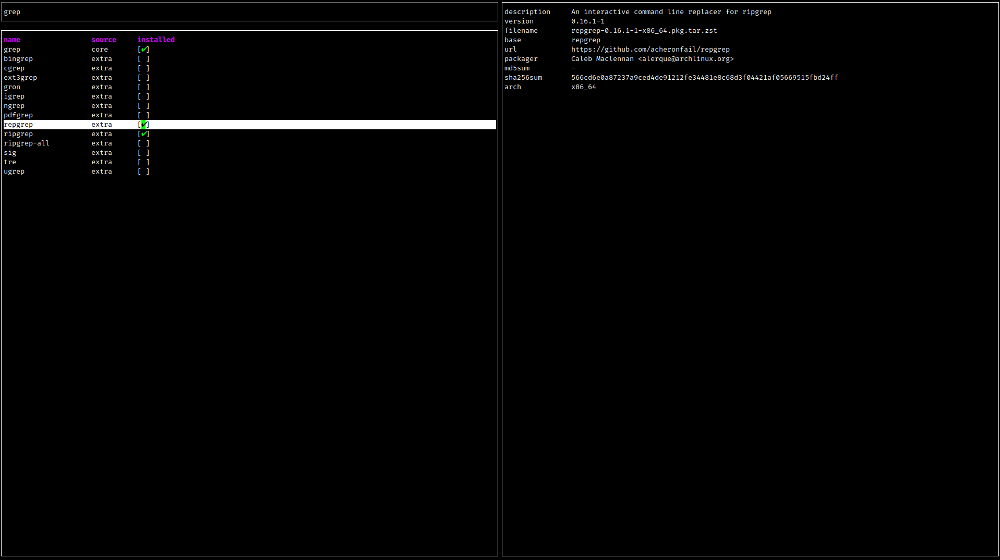

# PTU

A Terminal User Interface (TUI) for Arch Linux's Pacman package manager, built with Rust and Ratatui.



## Features

- Interactive package search with instant results
- **File/command search** — find which package provides a file (`pacman -F`)
- **AUR support** via yay/paru
- Package installation, update and removal
- **Multi-select packages** for batch install/remove
- **Package filtering** by install status and source
- **Installed packages tab** with sort by name/size/date/deps/update and name filter (`/`)
- **Update checker** — shows available updates for repo and AUR packages
- Detailed package information display (scrollable)
- **Help window** with keybindings reference (`?`)
- **Open package URL** in browser (`o`)
- Vim-like keyboard navigation
- **Mouse scroll support** for packages table and info panel
- Async AUR search (non-blocking UI)

## Requirements

- Arch Linux or Arch-based distribution (Manjaro, EndeavourOS, etc.)
- Rust and Cargo
- `yay` or `paru` (optional, for AUR support)

## Installation

### From Source

```bash
git clone https://github.com/jaennil/ptu.git
cd ptu

cargo build --release
sudo cp target/release/ptu /usr/local/bin/
```

## Usage

```bash
ptu
```

Logs are written to `/tmp/ptu.log`.

### Keyboard Controls

| Key                | Action                              |
|--------------------|-------------------------------------|
| `?`                | Toggle help window                  |
| `Tab`              | Cycle between panels                |
| `Alt+j`            | Focus packages table                |
| `Alt+k`            | Focus search input                  |
| `Alt+l`            | Focus package info                  |
| `Alt+h`            | Focus packages table (from info)    |
| `Esc`              | Exit application / close help       |

#### Search Input

| Key                | Action                              |
|--------------------|-------------------------------------|
| `<type>`           | Search packages (instant results)   |
| `Backspace`        | Delete character                    |
| `Ctrl+w`           | Delete word                         |
| `Ctrl+f`           | Toggle file/package search mode     |
| `Enter`            | Search files (in file search mode)  |

#### Packages Table

| Key                | Action                              |
|--------------------|-------------------------------------|
| `j` / `k`          | Navigate down / up                  |
| `g` / `G`          | Jump to top / bottom of the list    |
| `Space`            | Toggle package selection (multi-select) |
| `i`                | Install selected package            |
| `I`                | Batch install selected packages     |
| `r`                | Remove selected package             |
| `R`                | Batch remove selected packages      |
| `f`                | Enter filter mode                   |
| `/`                | Filter by name                      |
| `Enter`            | Apply name filter                   |
| `Esc`              | Clear name filter                   |

#### Filter Mode (Search Tab)

| Key                | Action                              |
|--------------------|-------------------------------------|
| `i`                | Cycle install filter (All/Installed/NotInstalled) |
| `a`                | Toggle AUR only                     |
| `p`                | Toggle Pacman only                  |
| `c`                | Clear all filters                   |
| `Esc`              | Exit filter mode                    |

#### Installed Table

| Key                | Action                              |
|--------------------|-------------------------------------|
| `j` / `k`          | Navigate down / up                  |
| `g` / `G`          | Jump to top / bottom of the list    |
| `s`                | Cycle sort column (Name/Size/Date/Deps/Update) |
| `S`                | Toggle sort direction               |
| `Space`            | Toggle package selection (multi-select) |
| `r`                | Remove selected package             |
| `R`                | Batch remove selected packages      |
| `/`                | Filter by name                      |
| `Enter`            | Apply filter                        |
| `Esc`              | Clear filter                        |
| `u`                | Toggle update filter                |
| `o`                | Toggle orphan filter                |
| `Ctrl+r`           | Refresh packages and updates        |
| `U`                | System upgrade menu                 |

#### Package Info

| Key                | Action                              |
|--------------------|-------------------------------------|
| `j` / `k`          | Scroll down / up                    |
| `Ctrl+d` / `Ctrl+u`| Page down / up                     |
| `o`                | Open package URL in browser         |
| `Mouse scroll`     | Scroll packages table or info panel |

## Components

1. **Package Input** - Search for packages by name, or toggle to file search mode (`Ctrl+f`) to find packages by file/command name
2. **Packages Table** - Displays matching packages with installation status, supports filtering
3. **Package Info** - Shows detailed information about the selected package (scrollable), including matched files in file search mode

## Architecture

Event-driven architecture with async support:

- **Instant pacman search** - results appear immediately on keystroke
- **File search** - `pacman -F` triggered on Enter (async, non-blocking)
- **Async AUR search** - non-blocking HTTP requests via tokio/reqwest
- **Debounced AUR queries** - 300ms delay to avoid excessive API calls
- Components handle rendering and input
- Actions represent user intentions
- Events update application state

## Project Structure

```
src/
├── action.rs           # User actions (search, install, etc.)
├── app.rs              # Main application logic + focus management + tokio runtime
├── aur.rs              # AUR API interface (async)
├── components/
│   ├── installed_table.rs # Installed packages with sort/filter
│   ├── package_info.rs # Scrollable package details
│   ├── package_input.rs
│   └── packages_table.rs
├── components.rs       # Component trait
├── event.rs            # Internal events
├── filter.rs           # Package filtering
├── layout.rs           # Layout constants
├── logging.rs          # Log configuration
├── main.rs             # Entry point
├── pacman.rs           # Pacman/alpm interface
├── panic_hook.rs       # Error handling
├── theme.rs            # UI theme
└── tui.rs              # Terminal management
```

## Dependencies

- `ratatui` - Terminal UI framework
- `alpm` - Arch Linux Package Manager interface
- `reqwest` - Async HTTP client (AUR)
- `tokio` - Async runtime
- `color-eyre` - Error handling
- `tracing` - Logging

## Contributing

Contributions are welcome!

1. Fork the repository
2. Create your feature branch (`git checkout -b feature/amazing-feature`)
3. Commit your changes
4. Push to the branch
5. Open a Pull Request
